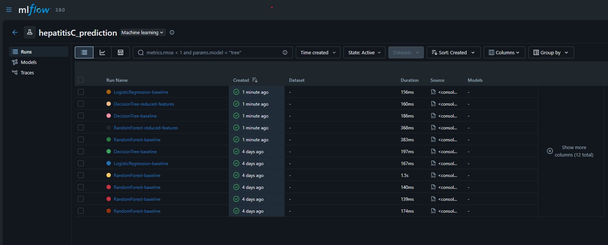
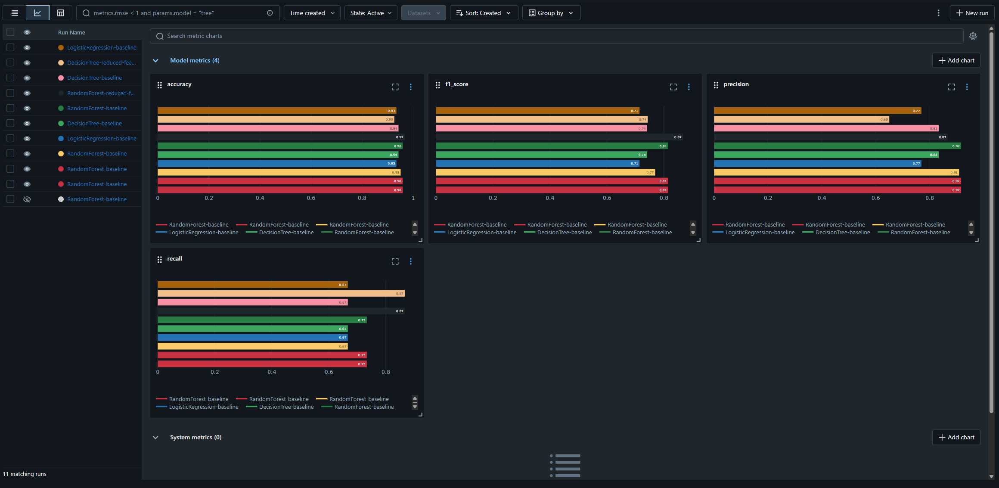
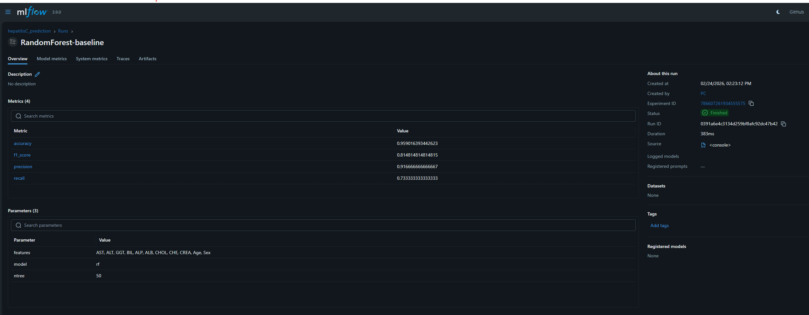
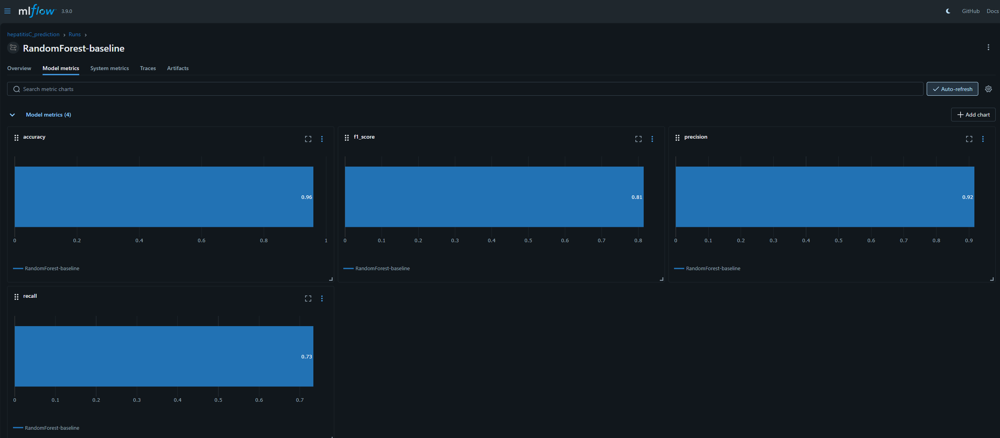

```{r setup, include=FALSE}
knitr::opts_chunk$set(echo = TRUE)
```

Tema: Hepatitis C\
Naziv: hepatitis-c-dataset.csv

Hepatitis C Prediction Dataset je skup podataka koji pruža detaljan uvid u laboratorijske nalaze krvi i osnovne demografske karakteristike pacijenata, sa ciljem analize zdravlja jetre.
Podaci obuhvataju biohemijske parametre jetre, kao što su alanin-aminotransferaze (ALT), aspartat-aminotransferaze (AST), gama-glutamil (GGT), bilirubin (BIL) i albumin (ALB), koji su značajni indikatori oštećenja i funkcije jetre.
Ciljna promenljiva Category označava zdravstveni status pacijenata, uključujući zdrave davaoce krvi i različite stadijume oboljenja jetre (hepatitis, fibroza i ciroza).
Podaci uključuju kliničke pokazatelje i demografske informacije, a prikupljeni su radi omogućavanja analize i izgradnje modela klasifikacije za razlikovanje zdravih i obolelih pacijenata.

Link ka skupu podataka na kaggle sajtu: <https://www.kaggle.com/datasets/fedesoriano/hepatitis-c-dataset>

# Prikaz podataka

Učitavanje potrebnih biblioteka

```{r}
library(tidyverse)
library(Amelia)
library(nortest)
library(ggplot2)
library(corrplot)
library(rpart)
library(rpart.plot)
library(randomForest)
library(caret)
library(pROC)
library(mice)
library(themis)
library(MLmetrics)
```

## Učitavanje skupa podataka

```{r}
dataset = read.csv("HepatitisCdata.csv", sep=",")
View(dataset)
```

Funkcija head prikazuje prvih šest redova dataset-a, čime se vrši inicijalni uvid u strukturu i format zapisa podataka.

```{r}
head(dataset)
```

Funkcije ncol i nrow daju informacije o dimenzijama (broju kolona i broju redova) skupa podataka.
Skup podataka ima 14 kolona i 615 redova.

```{r}
ncol(dataset)
nrow(dataset)
```

Funkcija str daje strukturu skupa podataka.
Prikazuje tip podatka za svaku promenljivu, kao i prvih nekoliko vrednosti u svakoj koloni.
U skupu podataka se nalazi 12 numeričkih promenljivih (int, num) i 2 kategorijske promenljive (chr).

```{r}
str(dataset)
```
## Opis skupa podataka

Skup podataka sadrži ukupno 14 promenljivih koje obuhvataju demografske karakteristike pacijenata, kao i relevantne biohemijske parametre krvi povezane sa funkcijom jetre. Opis pojedinačnih promenljivih dato je u nastavku:

X – numerička promenljiva koja predstavlja jedinstveni identifikacioni broj pacijenta
Category – kategorijska promenljiva koja označava zdravstveni status pacijenta
Age – numerička promenljiva koja označava starost pacijenta u godinama
Sex – kategorijska promenljiva koja označava pol pacijenta (m – muški, f – ženski)
ALB – koncentracija albumina u krvi
ALP – nivo alkalne fosfataze u krvi
ALT – nivo alanin-aminotransferaze u krvi
AST – nivo aspartat-aminotransferaze u krvi
BIL – nivo bilirubina u krvi
CHE – nivo holinesteraze u krvi
CHOL – nivo holesterola u krvi
CREA – nivo kreatinina u krvi
GGT – nivo gama-glutamil transferaze u krvi
PROT – ukupna koncentracija proteina u krvi

Većina navedenih biohemijskih parametara predstavlja značajne pokazatelje oštećenja i funkcije jetre, te su od ključnog značaja za analizu i predikciju oboljenja jetre.

## Promenljiva Category

Promenljiva Category predstavlja ciljnu promenljivu u ovom skupu podataka i služi za kliničku klasifikaciju pacijenata prema stanju jetre. Klasifikacija je izvršena na osnovu laboratorijskih nalaza krvi i medicinske dijagnostike, sa posebnim fokusom na oboljenja jetre izazvana virusom hepatitisa C.

Vrednosti promenljive Category označavaju sledeće zdravstvene statuse:

0 – Davalac krvi
Ova kategorija obuhvata zdrave osobe kod kojih laboratorijski parametri jetre ne pokazuju patološka odstupanja. Ovi ispitanici predstavljaju referentnu, odnosno kontrolnu grupu u analizi.

0s – Sumnjivi davalac krvi
U ovu grupu spadaju osobe kod kojih su prisutna manja odstupanja u pojedinim biohemijskim parametrima, ali bez jasnih dokaza postojanja oboljenja jetre. Ova kategorija ukazuje na potencijalno rizično stanje koje zahteva dodatno praćenje i dalju dijagnostiku.

1 – Hepatitis
Ova kategorija obuhvata pacijente kod kojih je dijagnostikovan hepatitis C, pri čemu je prisutna upala jetre, ali bez razvijenih trajnih strukturnih oštećenja. Laboratorijski nalazi često ukazuju na povišene vrednosti jetrenih enzima.

2 – Fibroza
Fibroza predstavlja napredniji stadijum oboljenja jetre, u kojem dolazi do stvaranja ožiljnog tkiva kao posledice dugotrajne upale. Funkcija jetre je delimično narušena, ali stanje još uvek nije nepovratno.

3 – Ciroza
Ciroza je najteži i hronični stadijum oboljenja jetre, karakterisan trajnim oštećenjem jetrenog tkiva i značajnim smanjenjem funkcije jetre. U ovom stadijumu laboratorijski parametri često pokazuju izrazita odstupanja, a stanje može biti životno ugrožavajuće.

Na osnovu promenljive Category moguće je sprovesti statističke analize, kao i razvijati modele mašinskog učenja sa ciljem predikcije zdravstvenog statusa pacijenata i ranog otkrivanja oboljenja jetre.

## Logička analiza podataka

**Provera odnosa ALB i PROT**

Ovaj korak obuhvata proveru odnos izmedju albumina, najzastupljenijeg proteina u krvi, i ukupnih proteina.
Ukupni proteini u krvi predstavljaju ukupnu količinu albumina i globulina u organizmu.
Kako je albumin samo jedan od proteina njegova vrednost ne može prelaziti vrednost ukupnih proteina.

```{r}
greske_alb_prot <- dataset[which(dataset$ALB > dataset$PROT), ]
nrow(greske_alb_prot)
```

```{r}
greske_alb_prot
```

Analiza je identifikovala samo jednu opservaciju koja narušava biološki odnos.
Na grafiku je vizuelno prikazan red u kom se nalazi pacijent kojem je albumin veći od ukupnih proteina.

```{r}
ggplot(dataset, aes(x = PROT, y = ALB)) +
  geom_point(alpha = 0.5) +
  geom_abline(color = "red") 
```

Identifikovana opservacija koja narušava logičko pravilo obrisana je iz daljeg procesa analize.

```{r}
dataset <- dataset[dataset$X != 217, ]

nrow(dataset[dataset$X == 217, ])
```

# Priprema podataka

## Nedostajuće vrednosti

Funkcija summary daje uvid u raspodelu podataka i može ukazati na nedostajuće vrednosti.

```{r}
summary(dataset)
```

Identifikacija nedostajućih vrednosti po kolonama vrši se kombinacijom funkcija is.na i colSums

```{r}
colSums(is.na(dataset))
```

Skup podataka ima nedostajuće vrednosti u 5 numeričkih kolona i to su: ALB, ALP, ALT, CHOL i PROT.
Ove podatke je potrebno pripremiti za dalju analizu.

```{r}
colMeans(is.na(dataset))*100
```

```{r}
par(mfrow=c(1,1))
missmap(obj = dataset, legend = FALSE, main = "Hepatitis C dataset")
```

Sa grafika se vidi da nedostajuće vrednosti čine mali procenat ukupnih podataka.

### Analiza i obrada nedostajućih vrednosti

Analiza prisustva nedostajućih vrednosti u kategorijskim kolonama Category i Sex se vrši korišćenjem frekvencijskih tabela u svrhu identifikacije svih postojećih kategorija i provere prisustva neočekivanih ili pogrešnih vrednosti.
Zatim se vrši provera prisustva eksplicitnih NA vrednosti i praznih stringova.

```{r}
table(dataset$Category)
```

```{r}
sum(is.na(dataset$Category) | dataset$Category == "")
```

```{r}
table(dataset$Sex)
```

```{r}
sum(is.na(dataset$Sex) | dataset$Sex == "")
```

Rezultati analize potvrđuju odsustvo neočekivanih kategorija, NA vrednosti i paznih polja unutar kolona Category i Sex.

Provera da li postoje redovi koji imaju više nedostajućih vrednosti

```{r}
na_po_redu <- rowSums(is.na(dataset))

broj_losih_redova <- sum(na_po_redu > 1)

procenat_losih <- (broj_losih_redova / nrow(dataset)) * 100

losi_redovi_data <- dataset[na_po_redu > 1, ]

print(losi_redovi_data)
```
Iako su identifikovana tri reda sa više nedostajućih vrednosti, bolje je da se oni ne brišu iz skupa podataka, jer pripadaju manjinskim klasama.


Nakon identifikacije nedostajućih vrednosti, umesto primene univarijantnih metoda poput zamene srednjom vrednošću ili medijanom, primenjen je MICE algoritam (*Multivariate Imputation by Chained Equations*).
Zamena srednjom vrednošću ili medijanom smanjuje varijansu podataka jer sve nedostajuće vrednosti postaju identične, dok MICE svakoj nedostajućoj vrednosti dodeljuje jedinstvenu vrednost na osnovu korelacije sa ostalim kolonama.

```{r}
dataset$Sex <- as.factor(dataset$Sex)
dataset$Category <- as.factor(dataset$Category)

imputed_data = mice(dataset, m=5, method = 'pmm', seed = 123, printFlag = FALSE)

dataset = complete(imputed_data, 1)
```

```{r}
colSums(is.na(dataset))
```

## Analiza raspodele podataka po kolonama

Analiza raspodele promenljivih prikazuje kako su podaci rasporedjeni u okviru svake kolone, omogućava uočavanje obrazaca u podacima, identifikuje da li postoje izuzeci itd.
Za proveru postojanja odstupajućih vrednosti primenjen je jedan od jednostavnih pristupa, a to je IQR metoda.
Glavna prednost ovog pristupa je u tome što se ne oslanja na aritmetičku sredinu, koja je izrazito osetljiva na ekstremne vrednosti, već na kvartile koji su znatno stabilniji.
Metoda podrazumeva izračunavanje prvog (Q1) i trećeg kvartila (Q3), na osnovu kojih se određuju donja i gornja granica (Q1 - 1.5 \* IQR i Q3 + 1.5 \* IQR).
Vrednosti koje odstupaju od ovih granica klasifikuju se kao odstupajuće vrednosti.
Zajedno sa računskim metodom, koriste se i boxplot-ovi za svaku kolonu radi vizuelne verifikacije ekstrema i lakše identifikacije odstupajućih vrednosti.

**Kolona Age**

```{r}
summary(dataset$Age)
```

Starost pacijenata je u rasponu od 19 do 77 godina.
Srednja vrednost iznosi 47.41, dok je medijana 47, što ukazuje na približno simetričnu raspodelu.
Većina pacijenata nalazi se u srednjim starosnim kategorijama.

Grafički prikaz raspodele pacijenata u odnosu na broj godina

Histogram raspodele pacijenata po godinama

```{r}
ggplot(dataset, aes(x = Age)) +
  geom_histogram(bins = 30) +
  labs(title = "Histogram raspodele godina")
```

Na grafiku se može uočiti da je najveći broj pacijenata starosti između 35 i 55 godina.
Raspodela je relativno ravnomerna, sa blagim asimetrijom, ali bez ekstremnih odstupanja.

Primenjena je provera prisustva odstupajućih vrednosti

```{r}

#Izračunavanje kvartila

Q1 <- quantile(dataset$Age, 0.25, na.rm = TRUE)
Q3 <- quantile(dataset$Age, 0.75, na.rm = TRUE)
IQR_val <- Q3 - Q1

#Određivanje granica za outlajere

donja_granica <- Q1 - 1.5 * IQR_val
gornja_granica <- Q3 + 1.5 * IQR_val

#Prikaz donje i gornje granice

donja_granica
gornja_granica

#Pronalaženje outlajera

outliers <- dataset$Age[dataset$Age < donja_granica | dataset$Age > gornja_granica]

#Broj outlajera

length(outliers)
outliers

```

Rezultati dobijeni za kolonu Age pokazuju da je donji kvartil 16.5, gornji kvartil 76.5, a pomoću IQR metode identifikovana je jedna odstupajuća vrednost.
To znači da postoji jedna vrednost koja odstupa od ostatka uzorka (77 godina), ali pošto nije jako ekstremna, njen uticaj na statistiku je mali i može se bez problema ostaviti u analizi.

Boxplot za vizuelnu detekciju odstupajućih vrednosti

```{r}

boxplot(dataset$Age, main = "Boxplot za Age", horizontal = TRUE)
```

Na boxplotu se može videti ta jedna odstupajuća vrednost koja se nalazi iznad 76.5.

**Kolona Sex**

S obzirom da je Sex kategorijska kolona, identifikaciju zastupljenosti pojedinačnih kategorija prikazana je pomoću tabele učestalosti.

```{r}
table(dataset$Sex)
```

Grafički prikaz raspodele polova

```{r}
ggplot(dataset, aes(x = Sex)) +
  geom_bar() +
  labs(title = "Raspodela polova u datasetu")
```

Na osnovu tabele učestalosti i grafika se može uočiti da u skupu podataka ima više pacijenata muškog pola.

**Kolona ALB**

Promenljiva ALB predstavlja koncentraciju albumina u krvi, izraženu u gramima po litru (g/L). Albumin je najzastupljeniji protein u krvnoj plazmi i ima ključnu ulogu u održavanju osmotskog pritiska, transportu različitih supstanci (hormona, lekova, masnih kiselina) i opštoj metaboličkoj ravnoteži organizma. Albumin se sintetiše u jetri, zbog čega njegova koncentracija predstavlja značajan indikator funkcionalnog stanja jetre.

Referentne vrednostii
Kod zdravih odraslih osoba, referentne vrednosti albumina u krvi obično se kreću u opsegu od 35 do 50 g/L.
Vrednosti ispod donje granice mogu ukazivati na:
1.hronična oboljenja jetre,
2.cirozu,
3.pothranjenost ili hronične upalne procese.

Povišene vrednosti albumina su ređe i najčešće se dovode u vezu sa:
1.dehidratacijom,
2.gubitkom telesne tečnosti.

Zbog toga je parametar ALB od posebnog značaja u analizi pacijenata sa hepatitisom C i drugim oboljenjima jetre.

Deskriptivna statistika promenljive ALB
```{r}
summary(dataset$ALB)
```

Vrednosti parametra ALB u posmatranom skupu podataka kreću se u rasponu od 14.9 do 82.2 g/L. Srednja vrednost iznosi 41.62 g/L, dok je medijana 41.95 g/L, što ukazuje na približno simetričnu raspodelu podataka bez izražene asimetrije. Većina pacijenata ima vrednosti albumina koncentrisane oko srednjih vrednosti, koje se u velikoj meri poklapaju sa referentnim opsegom za zdravu populaciju.

Grafički prikaz raspodele vrednosti ALB
```{r}
ggplot(dataset, aes(x = ALB)) +
  geom_histogram(bins = 30) +
  labs(title = "Histogram raspodele vrednosti albumina (ALB)",
       x = "ALB (g/L)",
       y = "Broj pacijenata")
```

Histogram pokazuje da najveći broj pacijenata ima vrednosti albumina u intervalu od 35 do 50 g/L, što odgovara normalnim referentnim vrednostima. Raspodela je relativno simetrična, uz prisustvo manjeg broja ekstremnih vrednosti na oba kraja raspodele.

Detekcija odstupajućih vrednosti (outlajera)
```{r}

Q1 <- quantile(dataset$ALB, 0.25, na.rm = TRUE)
Q3 <- quantile(dataset$ALB, 0.75, na.rm = TRUE)
IQR_val <- Q3 - Q1

donja_granica <- Q1 - 1.5 * IQR_val
gornja_granica <- Q3 + 1.5 * IQR_val

donja_granica
gornja_granica
```
Donji kvartil iznosi 29.2 g/L, dok gornji kvartil iznosi 54.8 g/L.

```{r}
outliers <- dataset$ALB[dataset$ALB < donja_granica | dataset$ALB > gornja_granica]
length(outliers)
outliers

```
Na osnovu IQR kriterijuma identifikovano je 27 odstupajućih vrednosti, što ukazuje na povećanu varijabilnost koncentracije albumina među pacijentima.

Boxplot analiza
```{r}
boxplot(dataset$ALB,
        main = "Boxplot koncentracije albumina (ALB)",
        horizontal = TRUE)
```
Boxplot vizuelno potvrđuje prisustvo većeg broja odstupajućih vrednosti, naročito na donjem delu raspodele, dok se manji broj ekstremnih vrednosti uočava i na gornjem kraju. S obzirom na to da se radi o kliničkom parametru direktno povezanom sa funkcijom jetre, ove vrednosti najverovatnije predstavljaju stvarna patološka stanja pacijenata, a ne greške u merenju.

Iz tog razloga, odstupajuće vrednosti nisu uklonjene iz dalje analize, kako bi se očuvala kompletna informacija o varijabilnosti podataka i omogućila preciznija analiza zdravstvenog statusa pacijenata.

**Kolona ALP**

Promenljiva ALP predstavlja nivo alkalne fosfataze u krvi, izražen u međunarodnim jedinicama po litru (U/L). Alkalna fosfataza je enzim koji se nalazi u više tkiva, prvenstveno u jetri, žučnim kanalima i kostima. U kliničkoj praksi, povišene vrednosti ALP često su povezane sa poremećajima u radu jetre i žučnih puteva, naročito kod opstrukcije žuči i hroničnih oboljenja jetre.

Referentne vrednosti

Referentne vrednosti ALP kod odraslih osoba najčešće se kreću u opsegu od 44 do 147 U/L, pri čemu blaga odstupanja mogu zavisiti od starosti i pola.
Povišene vrednosti ALP mogu ukazivati na:
1.oštećenje jetre ili žučnih puteva,
2.holestazu,
3.cirozu jetre.

Zbog toga je ALP značajan biohemijski marker u analizi pacijenata sa hepatitisom C.

Deskriptivna statistika promenljive ALP
```{r}
summary(dataset$ALP)
```

Vrednosti parametra ALP u posmatranom skupu podataka kreću se u rasponu od 11.30 do 416.60 U/L. Srednja vrednost iznosi 66.20 U/L, dok je medijana 68.22 U/L, što ukazuje na relativno simetričnu raspodelu centralnog dela podataka, uz prisustvo blage desne asimetrije.

Grafički prikaz raspodele vrednosti ALP
```{r}
ggplot(dataset, aes(x = ALP)) +
  geom_histogram(bins = 30) +
  labs(title = "Histogram raspodele vrednosti alkalne fosfataze (ALP)",
       x = "ALP (U/L)",
       y = "Broj pacijenata")
```
Histogram pokazuje da najveći broj pacijenata ima vrednosti ALP u opsegu od 50 do 100 U/L, dok se kod manjeg broja pacijenata uočavaju znatno povišene vrednosti. Raspodela ima izražen rep ka višim vrednostima, što ukazuje na prisustvo odstupajućih vrednosti.

Detekcija odstupajućih vrednosti
```{r}
Q1 <- quantile(dataset$ALP, 0.25, na.rm = TRUE)
Q3 <- quantile(dataset$ALP, 0.75, na.rm = TRUE)
IQR_val <- Q3 - Q1

donja_granica <- Q1 - 1.5 * IQR_val
gornja_granica <- Q3 + 1.5 * IQR_val

donja_granica
gornja_granica
```
Donji kvartil iznosi 10.35 U/L, dok je gornji kvartil 122.75 U/L. 

```{r}
outliers <- dataset$ALP[dataset$ALP < donja_granica | dataset$ALP > gornja_granica]
length(outliers)
outliers
```
Primenom IQR metode identifikovano je ukupno 11 odstupajućih vrednosti, što ukazuje na prisustvo pojedinačnih ekstremnih vrednosti u odnosu na većinu podataka.

Boxplot analiza (ALP)
```{r}
boxplot(dataset$ALP,
        main = "Boxplot vrednosti alkalne fosfataze (ALP)",
        horizontal = TRUE)

```
Boxplot za promenljivu ALP ukazuje na desno asimetričnu raspodelu sa nekoliko visokih odstupajućih vrednosti. S obzirom na klinički značaj ovog enzima, ove ekstremne vrednosti najverovatnije predstavljaju realna patološka stanja, a ne greške u merenju, zbog čega nisu uklonjene iz dalje analize.

**Kolona ALT**

Promenljiva ALT predstavlja nivo alanin-aminotransferaze, enzima koji se pretežno nalazi u ćelijama jetre i smatra se jednim od najosetljivijih pokazatelja oštećenja jetrenog tkiva. Povišene vrednosti ALT ukazuju na oštećenje hepatocita i često su prisutne kod pacijenata sa hepatitisom C.

Referentne vrednosti

Kod zdravih odraslih osoba, referentne vrednosti ALT najčešće se kreću u opsegu od:
-do 41 U/L kod muškaraca
-do 33 U/L kod žena

Značajno povišene vrednosti ALT najčešće su povezane sa:
-akutnim i hroničnim hepatitisom,
-cirozom jetre,
-drugim oboljenjima jetre.

Deskriptivna statistika promenljive ALT
```{r}
summary(dataset$ALT)
```

Vrednosti parametra ALT u skupu podataka kreću se u rasponu od 0.90 do 325.30 U/L. Srednja vrednost iznosi 28.44 U/L, dok je medijana 23.00 U/L. Srednja vrednost je primetno veća od medijane, što ukazuje na izraženu desnu asimetriju raspodele..

Grafički prikaz raspodele vrednosti ALT
```{r}
ggplot(dataset, aes(x = ALT)) +
  geom_histogram(bins = 30) +
  labs(title = "Histogram raspodele vrednosti ALT",
       x = "ALT (U/L)",
       y = "Broj pacijenata")
```
Histogram pokazuje da najveći broj pacijenata ima vrednosti ALT u opsegu od 15 do 40 U/L, dok se kod manjeg broja pacijenata javljaju veoma visoke vrednosti, koje formiraju izražen rep raspodele ka višim vrednostima.

Detekcija odstupajućih vrednosti (ALT)
```{r}
Q1 <- quantile(dataset$ALT, 0.25, na.rm = TRUE)
Q3 <- quantile(dataset$ALT, 0.75, na.rm = TRUE)
IQR_val <- Q3 - Q1

donja_granica <- Q1 - 1.5 * IQR_val
gornja_granica <- Q3 + 1.5 * IQR_val

donja_granica
gornja_granica
```
Donja granica za detekciju odstupajućih vrednosti iznosi −8.575 U/L, dok je gornja granica 58.025 U/L.

```{r}
outliers <- dataset$ALT[dataset$ALT < donja_granica | dataset$ALT > gornja_granica]
length(outliers)
outliers
```
Primenom IQR metode identifikovano je ukupno 36 gornjih odstupajućih vrednosti, dok donjih odstupanja nema.

Boxplot analiza (ALT)
```{r}
boxplot(dataset$ALT,
        main = "Boxplot vrednosti alanin-aminotransferaze (ALT)",
        horizontal = TRUE)
```
Boxplot vizuelno potvrđuje prisustvo velikog broja gornjih odstupajućih vrednosti, što dodatno ukazuje na izraženu desnu asimetriju raspodele. S obzirom na to da je ALT ključni marker oštećenja jetre, ove vrednosti najverovatnije predstavljaju realna patološka stanja kod pacijenata sa oboljenjima jetre i zbog toga nisu uklonjene iz dalje analize.

**Kolona AST**

Promenljiva AST predstavlja nivo aspartat-aminotransferaze, enzima koji se nalazi u ćelijama jetre, ali i u srčanom i mišićnom tkivu. Iako je manje specifičan za jetru u poređenju sa ALT, AST ima značajnu ulogu u proceni stepena oštećenja jetre, naročito kod uznapredovalih stadijuma oboljenja kao što su fibroza i ciroza.

Referentne vrednosti
Referentne vrednosti AST kod zdravih odraslih osoba obično se kreću do 40 U/L

Povišene vrednosti AST mogu ukazivati na:
1.akutna i hronična oboljenja jetre,
2.fibrozu i cirozu,
3.opsežnije oštećenje jetrenog tkiva.

Zbog toga je AST značajan parametar u analizi pacijenata sa hepatitisom C.

Deskriptivna statistika promenljive AST
```{r}
summary(dataset$AST)
```

Vrednosti parametra AST u posmatranom skupu podataka kreću se u rasponu od 10.60 do 324.00 U/L. Srednja vrednost iznosi 34.79 U/L, dok je medijana 25.90 U/L. Znatna razlika između srednje vrednosti i medijane ukazuje na izraženu desnu asimetriju raspodele.

Grafički prikaz raspodele vrednosti AST
```{r}
ggplot(dataset, aes(x = AST)) +
  geom_histogram(bins = 30) +
  labs(title = "Histogram raspodele vrednosti AST",
       x = "AST (U/L)",
       y = "Broj pacijenata")
```
Histogram pokazuje da najveći broj pacijenata ima vrednosti AST u opsegu od 20 do 40 U/L, dok se kod znatnog broja pacijenata javljaju visoke vrednosti koje prelaze 100 U/L, a u ekstremnim slučajevima dostižu i preko 300 U/L. Ovakav obrazac ukazuje na prisustvo izraženih patoloških stanja jetre kod dela ispitanika.

Detekcija odstupajućih vrednosti (AST)
```{r}
Q1 <- quantile(dataset$AST, 0.25, na.rm = TRUE)
Q3 <- quantile(dataset$AST, 0.75, na.rm = TRUE)
IQR_val <- Q3 - Q1

donja_granica <- Q1 - 1.5 * IQR_val
gornja_granica <- Q3 + 1.5 * IQR_val

donja_granica
gornja_granica
```
Donji kvartil iznosi 4.65 U/L, dok je gornji kvartil 49.85 U/L. 

```{r}
outliers <- dataset$AST[dataset$AST < donja_granica | dataset$AST > gornja_granica]
length(outliers)
outliers
```
Primenom IQR metode identifikovano je ukupno 64 odstupajuće vrednosti, što ukazuje na veliku varijabilnost ovog parametra među pacijentima.

Boxplot analiza (AST)
```{r}
boxplot(dataset$AST,
        main = "Boxplot vrednosti aspartat-aminotransferaze (AST)",
        horizontal = TRUE)
```

Boxplot vizuelno potvrđuje prisustvo velikog broja gornjih odstupajućih vrednosti i izraženu desnu asimetriju raspodele. S obzirom na klinički značaj AST kao pokazatelja oštećenja jetre, ove povišene vrednosti predstavljaju realna patološka stanja, te zbog toga nisu uklonjene iz dalje analize.

**Kolona BIL**

Promenljiva BIL predstavlja koncentraciju bilirubina u krvi, izraženu u mikromolima po litru (µmol/L). Bilirubin je produkt razgradnje hemoglobina i predstavlja jedan od ključnih pokazatelja funkcionalnog stanja jetre i žučnih puteva. Povišene vrednosti bilirubina često su povezane sa smanjenom sposobnošću jetre da obradi i eliminiše bilirubin iz organizma.

Referentne vrednosti
Kod zdravih odraslih osoba, ukupni bilirubin se obično kreće u opsegu od 5 do 21 µmol/L.

Povišene vrednosti bilirubina mogu ukazivati na:
1.hepatitis,
2.opstrukciju žučnih puteva,
3.cirozu jetre i druga teška oštećenja jetrene funkcije.

Deskriptivna statistika promenljive BIL
```{r}
summary(dataset$BIL)
```

Vrednosti parametra BIL u skupu podataka kreću se u rasponu od 0.8 do 254.00 µmol/L. Srednja vrednost iznosi 11.4 µmol/L, dok je medijana 7.3 µmol/L, što ukazuje na izraženu desnu asimetriju raspodele.

Grafički prikaz raspodele vrednosti BIL
```{r}
ggplot(dataset, aes(x = BIL)) +
  geom_histogram(bins = 30) +
  labs(title = "Histogram raspodele vrednosti bilirubina (BIL)",
       x = "Bilirubin (µmol/L)",
       y = "Broj pacijenata")
```
Histogram pokazuje da najveći broj pacijenata ima niske vrednosti bilirubina, najčešće u opsegu od 5 do 15 µmol/L, dok manji broj pacijenata ima izrazito povišene vrednosti koje prelaze 100 µmol/L, a u ekstremnim slučajevima dostižu i preko 200 µmol/L, što je karakteristično za teška oštećenja jetrene funkcije.

Detekcija odstupajućih vrednosti (BIL)
```{r}
Q1 <- quantile(dataset$BIL, 0.25, na.rm = TRUE)
Q3 <- quantile(dataset$BIL, 0.75, na.rm = TRUE)
IQR_val <- Q3 - Q1

donja_granica <- Q1 - 1.5 * IQR_val
gornja_granica <- Q3 + 1.5 * IQR_val

donja_granica
gornja_granica
```
Donji kvartil iznosi −3.55 µmol/L, dok gornji kvartil iznosi 20.05 µmol/L.


```{r}
outliers <- dataset$BIL[dataset$BIL < donja_granica | dataset$BIL > gornja_granica]
length(outliers)
outliers
```
Primenom IQR metode identifikovano je ukupno 47 odstupajućih vrednosti, što ukazuje na značajne varijacije u koncentraciji bilirubina među pacijentima.

Boxplot analiza (BIL)
```{r}
boxplot(dataset$BIL,
        main = "Boxplot vrednosti bilirubina (BIL)",
        horizontal = TRUE)
```
Boxplot ukazuje na desno asimetričnu raspodelu sa značajnim brojem gornjih odstupajućih vrednosti, što potvrđuje prisustvo pacijenata sa ozbiljno povišenim nivoima bilirubina. S obzirom na klinički značaj bilirubina kao ključnog indikatora funkcije jetre, ove vrednosti predstavljaju realna patološka stanja i zbog toga nisu uklonjene iz dalje analize.

**Kolona CHE**

Promenljiva CHE predstavlja nivo holinesteraze u krvi, enzima koji se dominantno sintetiše u jetri i predstavlja značajan pokazatelj sintetske funkcije jetre. Za razliku od transaminaza (ALT i AST), koje rastu kod akutnog oštećenja jetre, snižene vrednosti holinesteraze često ukazuju na hronična oboljenja jetre, kao što su fibroza i ciroza.

Referentne vrednosti
Referentne vrednosti holinesteraze kod zdravih odraslih osoba najčešće se kreću u opsegu od -5 do 12 kU/L (opseg može varirati u zavisnosti od laboratorije).

Snižene vrednosti CHE mogu ukazivati na:
1.smanjenu sintetsku sposobnost jetre,
2.hronična oboljenja jetre,
3.cirozu.

Povišene vrednosti su ređe i mogu biti povezane sa:
1.metaboličkim poremećajima,
2.gojaznošću ili određenim genetskim faktorima.

Deskriptivna statistika promenljive CHE
```{r}
summary(dataset$CHE)
```

Vrednosti parametra CHE u posmatranom skupu podataka kreću se u rasponu od 1.420 do 16.410 kU/L. Srednja vrednost iznosi 8.197 kU/L, dok je medijana 8.260 kU/L, što ukazuje na približno simetričnu raspodelu bez izražene asimetrije.

Grafički prikaz raspodele vrednosti CHE
```{r}
ggplot(dataset, aes(x = CHE)) +
  geom_histogram(bins = 30) +
  labs(title = "Histogram raspodele vrednosti holinesteraze (CHE)",
       x = "CHE (kU/L)",
       y = "Broj pacijenata")
```
Histogram pokazuje da najveći broj pacijenata ima vrednosti holinesteraze u opsegu od 6 do 10 kU/L, što u velikoj meri odgovara referentnim vrednostima za zdravu populaciju. Uočavaju se i potencijalne odstupajuće vrednosti kako na donjem, tako i na gornjem delu raspodele.

Detekcija odstupajućih vrednosti (CHE)
```{r}
Q1 <- quantile(dataset$CHE, 0.25, na.rm = TRUE)
Q3 <- quantile(dataset$CHE, 0.75, na.rm = TRUE)
IQR_val <- Q3 - Q1

donja_granica <- Q1 - 1.5 * IQR_val
gornja_granica <- Q3 + 1.5 * IQR_val

donja_granica
gornja_granica
```
Donji kvartil iznosi 2.95 kU/L, dok gornji kvartil iznosi 13.57 kU/L. 

```{r}
Q1 <- quantile(dataset$CHE, 0.25, na.rm = TRUE)
Q3 <- quantile(dataset$CHE, 0.75, na.rm = TRUE)
IQR_val <- Q3 - Q1

donja_granica <- Q1 - 1.5 * IQR_val
gornja_granica <- Q3 + 1.5 * IQR_val

donja_granica
gornja_granica
```
Primenom IQR metode identifikovane su ukupno 24 odstupajuće vrednosti, što ukazuje na značajnu varijabilnost u nivou holinesteraze među pacijentima.

Boxplot analiza (CHE)
```{r}
boxplot(dataset$CHE,
        main = "Boxplot vrednosti holinesteraze (CHE)",
        horizontal = TRUE)
```

Boxplot pokazuje prisustvo odstupajućih vrednosti na obe strane raspodele, što potvrđuje postojanje pacijenata sa izrazito sniženim i izrazito povišenim vrednostima holinesteraze. S obzirom na to da je CHE važan marker funkcionalnog stanja jetre, ove vrednosti verovatno predstavljaju realna klinička stanja, zbog čega nisu uklonjene iz dalje analize.

**Kolona CHOL**

Promenljiva CHOL predstavlja koncentraciju ukupnog holesterola u krvi, izraženu u mmol/L. Holesterol je esencijalna lipidna komponenta ćelijskih membrana i učestvuje u sintezi hormona i žučnih kiselina. Jetra ima ključnu ulogu u metabolizmu holesterola, zbog čega poremećaji njene funkcije mogu dovesti do promena u njegovim vrednostima.

Referentne vrednosti
Referentne vrednosti ukupnog holesterola kod odraslih osoba najčešće se definišu kao:
- < 5.2 mmol/L – poželjne vrednosti
- 5.2 – 6.2 mmol/L – granične vrednosti
- > 6.2 mmol/L – povišene vrednosti

Vrednosti holesterola zavise od:

1.ishrane,
2.genetike,
3.metaboličkog statusa,
4.opšteg zdravstvenog stanja.

Deskriptivna statistika promenljive CHOL
```{r}
summary(dataset$CHOL)
```
Vrednosti parametra CHOL u skupu podataka kreću se u rasponu od 1.430 do 9.670 mmol/L. Srednja vrednost iznosi 5.367 mmol/L, dok je medijana 5.300 mmol/L, što ukazuje na približno simetričnu raspodelu bez izražene asimetrije.

Grafički prikaz raspodele vrednosti CHOL
```{r}
ggplot(dataset, aes(x = CHOL)) +
  geom_histogram(bins = 30) +
  labs(title = "Histogram raspodele vrednosti holesterola (CHOL)",
       x = "Holesterol (mmol/L)",
       y = "Broj pacijenata")
```
Histogram pokazuje da najveći broj pacijenata ima vrednosti holesterola u opsegu od približno 4.5 do 6.0 mmol/L, dok se kod manjeg broja ispitanika javljaju i niže i više vrednosti, koje odstupaju od centralnog dela raspodele.

Detekcija odstupajućih vrednosti (CHOL)
```{r}
Q1 <- quantile(dataset$CHOL, 0.25, na.rm = TRUE)
Q3 <- quantile(dataset$CHOL, 0.75, na.rm = TRUE)
IQR_val <- Q3 - Q1

donja_granica <- Q1 - 1.5 * IQR_val
gornja_granica <- Q3 + 1.5 * IQR_val

donja_granica
gornja_granica
```
Donji kvartil iznosi 2.46 mmol/L, dok gornji kvartil iznosi 8.21 mmol/L. 

```{r}
Q1 <- quantile(dataset$CHOL, 0.25, na.rm = TRUE)
Q3 <- quantile(dataset$CHOL, 0.75, na.rm = TRUE)
IQR_val <- Q3 - Q1

donja_granica <- Q1 - 1.5 * IQR_val
gornja_granica <- Q3 + 1.5 * IQR_val

donja_granica
gornja_granica
```

Primenom IQR metode identifikovano je ukupno 12 odstupajućih vrednosti, što ukazuje na umerenu varijabilnost u nivou holesterola među pacijentima.

Boxplot analiza (CHOL)
```{r}
boxplot(dataset$CHOL,
        main = "Boxplot vrednosti holesterola (CHOL)",
        horizontal = TRUE)
```

Boxplot ukazuje na prisustvo odstupajućih vrednosti na oba kraja raspodele, što potvrđuje postojanje pacijenata sa ekstremno sniženim i povišenim nivoima holesterola. S obzirom na to da je holesterol parametar koji značajno zavisi od ishrane, genetike i opšteg zdravstvenog stanja, ovakva odstupanja se smatraju realnim i zbog toga nisu uklonjena iz dalje analize.

**Kolona CREA**

Promenljiva CREA predstavlja koncentraciju kreatinina u krvi, koji je krajnji produkt metabolizma mišića i jedan od najvažnijih pokazatelja funkcije bubrega. Kreatinin se iz organizma izlučuje gotovo isključivo putem bubrega, pa povišene vrednosti ukazuju na smanjenu glomerularnu filtraciju.
Kod pacijenata sa teškim oboljenjima jetre često dolazi do sekundarnog oštećenja bubrega (hepatorenalni sindrom), zbog čega je analiza kreatinina posebno značajna u ovom kontekstu.

Referentne vrednosti (domensko objašnjenje)
Uobičajene referentne vrednosti kreatinina kod odraslih osoba su približno 60–110 µmol/L (uz zavisnost od pola, starosti i mišićne mase)

Deskriptivna statistika promenljive CREA
```{r}
summary(dataset$CREA)
```

Vrednosti parametra CREA u posmatranom skupu podataka kreću se u rasponu od 8.00 do 1079.10 µmol/L. Srednja vrednost iznosi 81.29 µmol/L, dok je medijana 77.00 µmol/L, što ukazuje na desno asimetričnu raspodelu, jer mali broj ekstremno visokih vrednosti značajno utiče na povećanje srednje vrednosti.

Grafički prikaz raspodele vrednosti CREA
```{r}
ggplot(dataset, aes(x = CREA)) +
  geom_histogram(bins = 30) +
  labs(title = "Histogram raspodele vrednosti kreatinina (CREA)",
       x = "Kreatinin (µmol/L)",
       y = "Broj pacijenata")
```
Histogram pokazuje da se najveći broj pacijenata nalazi u opsegu vrednosti između 60 i 100 µmol/L, što odgovara normalnoj ili blago povišenoj funkciji bubrega. Međutim, uočava se izražen rep ka višim vrednostima, koji ukazuje na prisustvo pacijenata sa ozbiljno narušenom bubrežnom funkcijom.

Detekcija odstupajućih vrednosti (CREA)
```{r}
Q1 <- quantile(dataset$CREA, 0.25, na.rm = TRUE)
Q3 <- quantile(dataset$CREA, 0.75, na.rm = TRUE)
IQR_val <- Q3 - Q1

donja_granica <- Q1 - 1.5 * IQR_val
gornja_granica <- Q3 + 1.5 * IQR_val

donja_granica
gornja_granica
```

Donji kvartil iznosi 35.5 µmol/L, dok gornji kvartil iznosi 119.5 µmol/L. 

```{r}
outliers <- dataset$CREA[dataset$CREA < donja_granica | dataset$CREA > gornja_granica]
length(outliers)
outliers

```

Primenom IQR metode identifikovano je ukupno 12 odstupajućih vrednosti, uključujući ekstremno visoke vrednosti (npr. 519.0 i 1079.1 µmol/L).

Boxplot analiza (CREA)
```{r}
boxplot(dataset$CREA,
        main = "Boxplot vrednosti kreatinina (CREA)",
        horizontal = TRUE)
```
Boxplot potvrđuje izraženu desnu asimetriju raspodele sa malim brojem ekstremno visokih vrednosti. S obzirom na klinički značaj ovih vrednosti i njihovu povezanost sa ozbiljnim zdravstvenim stanjima, odstupajuće vrednosti nisu uklonjene iz dalje analize.

**Kolona GGT**

Promenljiva GGT predstavlja koncentraciju enzima gama-glutamil transferaze, koji je izuzetno osetljiv marker oštećenja jetre i žučnih puteva. GGT je naročito povišen kod holestaze, alkoholne bolesti jetre i drugih hepatobilijarnih poremećaja.

Referentne vrednosti (domensko objašnjenje)
Tipične referentne vrednosti GGT su manje od 50 U/L (uz zavisnost od pola i laboratorije)

Deskriptivna statistika promenljive GGT
```{r}
summary(dataset$GGT)
```

Vrednosti parametra GGT kreću se u rasponu od 4.50 do 650.90 U/L. Srednja vrednost iznosi 39.53 U/L, dok je medijana 23.30 U/L, što jasno ukazuje na izraženu desnu asimetriju raspodele.

Grafički prikaz raspodele vrednosti GGT
```{r}
ggplot(dataset, aes(x = GGT)) +
  geom_histogram(bins = 30) +
  labs(title = "Histogram raspodele vrednosti GGT",
       x = "GGT (U/L)",
       y = "Broj pacijenata")
```
Histogram pokazuje da većina pacijenata ima relativno niske vrednosti GGT, dok manji broj pacijenata ima izuzetno visoke vrednosti, koje formiraju izražen rep ka desnoj strani raspodele.

Detekcija odstupajućih vrednosti (GGT)
```{r}
Q1 <- quantile(dataset$GGT, 0.25, na.rm = TRUE)
Q3 <- quantile(dataset$GGT, 0.75, na.rm = TRUE)
IQR_val <- Q3 - Q1

donja_granica <- Q1 - 1.5 * IQR_val
gornja_granica <- Q3 + 1.5 * IQR_val

donja_granica
gornja_granica
```
Donji kvartil iznosi -21.05U/L, dok gornji kvartil iznosi 76.95U/L.

```{r}
outliers <- dataset$GGT[dataset$GGT < donja_granica | dataset$GGT > gornja_granica]
length(outliers)
outliers
```
Primenom IQR metode identifikovano je 65 odstupajućih vrednosti, pri čemu gornje vrednosti dostižu i 650.9 U/L.Ovako veliki broj ekstremnih vrednosti ukazuje na izražene patološke promene jetre i žučnih puteva kod značajnog broja pacijenata.

Boxplot analiza (GGT)
```{r}
boxplot(dataset$GGT,
        main = "Boxplot vrednosti GGT",
        horizontal = TRUE)
```

Boxplot jasno potvrđuje izraženu desnu asimetriju sa velikim brojem gornjih odstupajućih vrednosti. S obzirom na visoku dijagnostičku vrednost GGT enzima, ove ekstremne vrednosti predstavljaju realna klinička stanja i nisu uklonjene iz dalje analize.

**Kolona PROT**

Promenljiva PROT predstavlja koncentraciju ukupnih proteina u serumu, koji uključuju albumine i globuline. Jetra ima ključnu ulogu u sintezi većine serumskih proteina, pa snižene vrednosti PROT često ukazuju na smanjenu sintetsku funkciju jetre, ali i na poremećaje ishrane ili hronične bolesti.

Referentne vrednosti (domensko objašnjenje)
Referentne vrednosti ukupnih proteina u serumu najčešće se kreću u opsegu:
- 64–83 g/L

Deskriptivna statistika promenljive PROT
```{r}
summary(dataset$PROT)
```

Vrednosti parametra PROT kreću se u rasponu od 44.80 do 90.00 g/L. Srednja vrednost iznosi 72.04 g/L, dok je medijana 72.20 g/L, što ukazuje na približno simetričnu raspodelu bez izražene asimetrije.

Grafički prikaz raspodele vrednosti PROT
```{r}
ggplot(dataset, aes(x = PROT)) +
  geom_histogram(bins = 30) +
  labs(title = "Histogram raspodele ukupnih proteina (PROT)",
       x = "Ukupni proteini (g/L)",
       y = "Broj pacijenata")
```
Histogram pokazuje da se najveći broj pacijenata nalazi u opsegu od 65 do 80 g/L, dok manji broj pacijenata ima znatno niže ili više vrednosti.

Detekcija odstupajućih vrednosti (PROT)
```{r}
Q1 <- quantile(dataset$PROT, 0.25, na.rm = TRUE)
Q3 <- quantile(dataset$PROT, 0.75, na.rm = TRUE)
IQR_val <- Q3 - Q1

donja_granica <- Q1 - 1.5 * IQR_val
gornja_granica <- Q3 + 1.5 * IQR_val

donja_granica
gornja_granica
```
Donji kvartil iznosi 60.15 g/L, dok gornji iznosi 84.55 g/L. 

```{r}
outliers <- dataset$PROT[dataset$PROT < donja_granica | dataset$PROT > gornja_granica]
length(outliers)
outliers

```

Primenom IQR metode identifikovano je ukupno 20 odstupajućih vrednosti, od kojih se značajan deo nalazi ispod donje granice. Snižene vrednosti ukupnih proteina (npr. 44.8 i 47.0 g/L) ukazuju na smanjenu sposobnost jetre da sintetiše proteine, što je karakteristično za uznaprdeovala oboljenja jetre.

Boxplot analiza (PROT)
```{r}
boxplot(dataset$PROT,
        main = "Boxplot vrednosti ukupnih proteina (PROT)",
        horizontal = TRUE)
```

Boxplot ukazuje na prisustvo odstupajućih vrednosti na oba kraja raspodele, pri čemu su klinički posebno značajne niske vrednosti proteina, jer direktno ukazuju na poremećaj sintetske funkcije jetre. Zbog toga odstupajuće vrednosti nisu uklonjene iz dalje analize.

##Zakljućak analize

Eksplorativna analiza pokazala je da većina biohemijskih parametara ima izraženu desnu asimetriju i prisustvo odstupajućih vrednosti, naročito kod jetrenih enzima (ALT, AST, GGT), bilirubina i kreatinina. Ovakva raspodela je očekivana s obzirom na to da skup podataka obuhvata pacijente sa različitim stadijumima oboljenja jetre. Identifikovane odstupajuće vrednosti predstavljaju realna klinička stanja, a ne greške u merenju, zbog čega nisu uklonjene iz dalje analize. Dobijeni rezultati ukazuju na značajnu varijabilnost podataka i potvrđuju njihovu pogodnost za dalju statističku analizu i izgradnju klasifikacionih modela.


**Kolona Category - izlazna kolona**

Pošto je Category kategorijska kolona prikazana je tabela učestalosti kako bi se videlo koliko puta se svaka kategorija pojavljuje.

```{r}
table(dataset$Category)
```

Izlazna kolona Category predstavlja zdravstveni status pacijenta i sadrži pet klasa: 0 – Blood Donor, 0s – Suspect Blood Donor, 1 – Hepatitis, 2 – Fibrosis i 3 – Cirrhosis.

Grafički prikaz raspodele kategorija

```{r}
ggplot(dataset, aes(x = Category)) +
  geom_bar() +
  labs(title = "Raspodela kategorija zdravstvenog statusa pacijenata u datasetu")
```

Na osnovu tabele učestalosti i grafičkog prikaza, uočava se značajan disbalans klasa.
Kategorija "0=Blood Donor" dominira sa 532 uzorka, dok su ostale kategorije izrazito malobrojne.

U svrhu optimizacije performansi modela mašinskog učenja i preciznijeg prepoznavanja razlike, urađeno je spajanje kategorija u dve logičke celine (binarna klasifikacija):

1.  Blood Donor – Spajamo kategorije "0=Blood Donor" i "0s=suspect Blood Donor", jer su sumnjivi donori idalje pacijenti koji nemaju potvrđeno oboljenje jetre.

2.  Hepatitis C – Spajamo kategorije "1=Hepatitis", "2=Fibrosis" i "3=Cirrhosis", jer one zapravo predstavljaju različite stadijume progresije iste bolesti

```{r}
dataset$Target <- ifelse(dataset$Category %in% c("0=Blood Donor", "0s=suspect Blood Donor"), 
                         "Blood Donor", "Hepatitis C")

dataset$Target <- as.factor(dataset$Target)

table(dataset$Target)
```

# Analiza podataka

## Analiza izmedju prediktora i odgovora

U skladu sa medicinskim činjenicama, najvažniji pokazatelji oštećenja jetre su ALT, AST, GGT i BIL, pri čemu kombinacije ovih parametara daju bolje rezultate u razlikovanju zdravih pacijenata i pacijenata sa hepatitisom C nego pojedinačni parametri.

### Kolona ALT

Grafikom ispod prikazan je odnos između kategorije pacijenata i vrednosti ALT enzima.

```{r}
ggplot(data = dataset, aes(x = Target, y = ALT)) +
  geom_boxplot() +
  labs(
    title = "Distribucija ALT vrednosti po kategorijama pacijenata",
    x = "Kategorija pacijenata",
    y = "ALT"
  ) +
  theme(axis.text.x = element_text(angle = 45, hjust = 1))
```

ALT bi u većini slučajeva trebalo da bude viši kod pacijenata sa oštećenjem jetre, ali to nije uvek pravilo, kod nekih pacijenata ALT može biti normalan ili da se menja kroz vreme, što se može videti preklapanjem između kategorija na boxplotu.
Zbog toga ALT nije dovoljan sam za pouzdanu procenu oštećenja jetre.

### Kolona AST

Grafikom ispod prikazan je odnos između kategorije pacijenata i vrednosti AST enzima.

```{r}
ggplot(data = dataset, aes(x = Target, y = AST)) +
  geom_boxplot() +
  labs(
    title = "Distribucija AST vrednosti po kategorijama pacijenata",
    x = "Kategorija pacijenata",
    y = "AST"
  ) +
 theme(axis.text.x = element_text(angle = 45, hjust = 1))
```

Na grafiku se može videti da su AST vrednosti kod pacijenata sa oštećenjem jetre u proseku više nego kod zdravih pacijenata, uz mnogo veći raspon.
Za razliku od ALT-a, ovde je razlika između kategorija izraženija.
Zbog toga može da se zaključi da AST može biti značajan prediktor u ovom skupu podataka.

### Kolona GGT

Grafikom ispod prikazan je odnos između kategorije pacijenata i vrednosti GGT enzima.

```{r}
ggplot(data = dataset, aes(x = Target, y = GGT)) +
  geom_boxplot() +
  labs(
    title = "Distribucija GGT vrednosti po kategorijama pacijenata",
    x = "Kategorija pacijenata",
    y = "GGT"
  ) +
 theme(axis.text.x = element_text(angle = 45, hjust = 1))
```

Na grafiku se može uočiti da se vrednosti GGT kod zdravih pacijenata i onima sa oštećenjem jetre skoro uopšte ne preklapaju.
Kod zdravih pacijenata GGT ima dosta niže vrednosti, dok kod pacijenata sa oštećenjem jetre GGT ima značajno višu medijanu i veći raspon, što i jeste u skladu sa medicinskim činjenicama.
Na osnovu ovoga može se zaključiti da bi GGT bio vrlo značajan prediktor u ovom skupu podataka.

### Kolona BIL

Grafikom ispod prikazan je odnos između kategorije pacijenata i vrednosti BIL.

```{r}
ggplot(data = dataset, aes(x = Target, y = BIL)) +
  geom_boxplot() +
  labs(
    title = "Distribucija BIL vrednosti po kategorijama pacijenata",
    x = "Kategorija pacijenata",
    y = "BIL"
  ) +
  theme(axis.text.x = element_text(angle = 45, hjust = 1))
```

Nivo bilirubina kod zdravih pacijenata je nizak, dok porast vrednosti prate progresivna oštećenja jetre, što se može videti na grafiku.
Kategorija pacijenata sa oštečenjem jetre ima viši nivo medijane i značajno veći broj ekstremnih vrednosti.
Zaključuje se da je BIL takođe značajan kandidat za predikciju.

### Kolona ALB

Grafikom ispod prikazan je odnos između kategorije pacijenata i vrednosti albumina.

```{r}
ggplot(data = dataset, aes(x = Target, y = ALB)) +
  geom_boxplot() +
  labs(
    title = "Distribucija ALB vrednosti po kategorijama pacijenata",
    x = "Kategorija pacijenata",
    y = "ALB"
  ) +
  theme(axis.text.x = element_text(angle = 45, hjust = 1))
```

Na grafiku se može uočiti da postoji jasno preklapanje izmedju kategorija.
Iako se kod pacijenata sa oštećenjem jetre primećuje blagi pad medijane i širi raspon nižih vrednosti, većina njihovih rezultata i dalje pada u opseg normalnih vrednosti za zdrave pacijente.
Na osnovu ovoga može se zaključiti da ALB ne bi bio značajan samostalan prediktor.

### Kolona ALP

Grafikom ispod prikazan je odnos između kategorije pacijenata i vrednosti ALP enzima.

```{r}
ggplot(data = dataset, aes(x = Target, y = ALP)) +
  geom_boxplot() +
  labs(
    title = "Distribucija ALP vrednosti po kategorijama pacijenata",
    x = "Kategorija pacijenata",
    y = "ALP"
  ) +
  theme(axis.text.x = element_text(angle = 45, hjust = 1))
```

Na grafiku se može videti gotovo potpuno preklapanje interkvartilnih opsega obe kategorije, odnosno većina podataka za obe kategorije se nalazi u istom opsegu, što bi onemogućilo modelu da jasno definiše granicu između kategorija samo na osnovu ovog parametra.

### Kolona CHE

Grafikom ispod prikazan je odnos između kategorije pacijenata i vrednosti CHE enzima.

```{r}
ggplot(data = dataset, aes(x = Target, y = CHE)) +
  geom_boxplot() +
  labs(
    title = "Distribucija CHE vrednosti po kategorijama pacijenata",
    x = "Kategorija pacijenata",
    y = "CHE"
  ) +
  theme(axis.text.x = element_text(angle = 45, hjust = 1))
```

Na osnovu grafika vidimo preklapanje interkvartilnih opsega između zdravih pacijenata i pacijenata sa oštećenjem jetre.
Takodje, vidimo i trend pada vrednosti CHE kod pacijenata sa oštećenjem jetre, i raspon vrednosti je znatno širi.
U nastavku ćemo uraditi analizu u kombinaciji sa drugim parametrima jetre.

### Kolona CHOL

Grafikom ispod prikazan je odnos između kategorije pacijenata i vrednosti holesterola.

```{r}
ggplot(data = dataset, aes(x = Target, y = CHOL)) +
  geom_boxplot() +
  labs(
    title = "Distribucija CHOL vrednosti po kategorijama pacijenata",
    x = "Kategorija pacijenata",
    y = "CHOL"
  ) +
  theme(axis.text.x = element_text(angle = 45, hjust = 1))
```

Na osnovu grafika se može videti preklapanje interkvartilnih opsega između zdravih pacijenata i pacijenata sa oštećenjem jetre, sa trendom nižih vrednosti kod bolesne grupe, gde je medijana pomerena naniže u odnosu na zdravu grupu.
Može se aključiti da iako CHOL nije značajan samostalan prediktor.

### Kolona CREA

Grafikom ispod prikazan je odnos između kategorije pacijenata i vrednosti kreatinina.

```{r}
ggplot(data = dataset, aes(x = Target, y = CREA)) +
  geom_boxplot() +
  labs(
    title = "Distribucija CREA vrednosti po kategorijama pacijenata",
    x = "Kategorija pacijenata",
    y = "CREA"
  ) +
  theme(axis.text.x = element_text(angle = 45, hjust = 1))
```

Kreatinin zapravo nije primarni marker za jetru, već za funkciju bubrega, što se može videti i na distribuciji podataka.
Dakle, na osnovu grafika vidimo skoro potpuno preklapanje interkvartilnih opsega, što ukazuje na to da CREA samostalno ne predstavlja pouzdan indikator u razlikovanju zdravih pacijenata od pacijenata sa oštećenjem jetre.

### Kolona PROT

Grafikom ispod prikazan je odnos između kategorije pacijenata i vrednosti ukupnih proteina.

```{r}
ggplot(data = dataset, aes(x = Target, y = PROT)) +
  geom_boxplot() +
  labs(
    title = "Distribucija vrednosti proteina po kategorijama pacijenata",
    x = "Kategorija pacijenata",
    y = "PROT"
  ) +
  theme(axis.text.x = element_text(angle = 45, hjust = 1))
```

Na osnovu grafika se može videti preklapanje interkvartilnih opsega između zdravih pacijenata i onih sa oštečenjem jetre Iako kategorija pacijenata sa oštečenjem jetre pokazuje nešto širi raspon vrednosti naviše, medijane obe grupe su pozicionirane veoma blizu.
PROT samostalno ne predstavlja pouzdan indikator u razlikovanju zdravih pacijenata od pacijenata sa oštećenjem jetre.

### Kolona Age

Grafikom ispod prikazan je odnos između kategorije pacijenata i starosti.

```{r}
ggplot(data = dataset, aes(x = Target, y = Age)) +
  geom_boxplot() +
  labs(
    title = "Distribucija starosti po kategorijama pacijenata",
    x = "Kategorija pacijenata",
    y = "Age"
  ) +
  theme(axis.text.x = element_text(angle = 45, hjust = 1))
```

Na grafiku se može uočiti preklapanje interkvartilnih opsega između zdravih pacijenata i pacijenata sa oštećenjem jetre, što ukazuje na to da starost sama po sebi nije značajan prediktor za prisustvo bolesti.

### Kolona Sex

Grafikom ispod prikazan je odnos između kategorije pacijenata i polova.

```{r}
ggplot(data = dataset, aes(x = Target, fill = Sex)) +
  geom_bar(position = "dodge") +
  labs(
    title = "Distribucija pola po kategorijama pacijenata",
    x = "Kategorija pacijenata",
    y = "Broj pacijenata",
    fill = "Pol"
  ) +
  theme(axis.text.x = element_text(angle = 45, hjust = 1))

```

Na osnovu prikazanog grafikona može se uočiti da je u obe kategorije pacijenata zastupljen veći broj muškaraca u odnosu na žene.
U okviru ovog skupa podataka, pol ne predstavlja dobar prediktor za razlikovanje pacijenata sa oštećenjem jetre od zdravih pacijenata.

## Multivarijantna analiza

Nakon detaljne univarijantne analize pojedinačnih biohemijskih parametara, naredni korak analize obuhvata ispitivanje odnosa između više parametara.

### Odnos AST i ALT

ALT i AST u krvi su ključni markeri oštećenja jetre, jer se ovi enzimi oslobađaju iz ćelija jetre kada su one oštećene.
Odnos između njih pomaže lekarima u proceni oštećenja jetre.
Primenjena je logaritamska skala, zato što AST i ALT u ovom skupu podataka imaju ogroman opseg, od normalnih vrednosti do ekstremnih vrednosti, koje bi "pogurale" sve ostale tačke u jedan ugao grafika.

```{r}
ggplot(dataset, aes(x = AST, y = ALT)) +
  geom_point(alpha = 0.6, size = 2.5, color = "#e74c3c") +
  scale_x_log10() +
  scale_y_log10() +
  labs(title = "AST vs ALT", x = "AST", y = "ALT") +
  theme_minimal()
```

Na osnovu grafika može se uočiti da kako rastu vrednosti AST, tako rastu i vrednosti ALT, ali i da značajan broj opservacija odstupa od linearne regresije.

### Odnos AST i ALT po kategorijama pacijenata

```{r}
ggplot(dataset, aes(x = AST, y = ALT, color = Target)) +
  geom_point(alpha = 0.6, size = 2.5) +
  scale_x_log10() + 
  scale_y_log10() +
  labs(title = "Odnos AST i ALT: Marker oštećenja ćelija",
       x = "AST",
       y = "ALT") +
  theme_minimal()
```

Dodavanjem izlazne kolone na grafik, uočava se da pomenuta odstupanja nisu slučajna već da su povezana sa dijagnozom, odnosno pripadaju pacijentima sa oštećenjem jetre.
Kod najvećeg broja zdravih pacijenata vrednosti AST i ALT koncentrisane u veoma uskom opsegu normalnih fizioloških vrednosti.
Za razliku od zdravih pacijenata, kod onih koji imaju oštećenje jetre vidi se izrazita raspršenost podataka, što govori o različitim stadijumima oštećenja jetre.

### Odnos GGT i AST po kategorijama pacijenata

Prethodne analize su pokazale da su GGT i AST pojedinačno značajni prediktori i zbog toga je sada prikazan njihov medjusobni odnos.

```{r}
ggplot(dataset, aes(x = GGT, y = AST, color = Target)) +
  geom_point(alpha = 0.6, size = 2.5) +
  scale_x_log10() + 
  labs(title = "Odnos GGT i AST po kategorijama") +
  theme_minimal()
```

Na osnovu grafika se može videti razdvajanje izmedju kategorija.
Zdravi pacijenti su koncentrisani u području niskih vrednosti oba parametra, dok kod pacijenata sa oštećenjem jetre dolazi do rasipanja vrednosti ka višim vrednostima oba parametra.
Vrednosti GGT su povišene i kada su vrednosti AST relativno stabilne.

## Zaključak na osnovu dosadašnje analize

Na osnovu sprovedene analize može se zaključiti da zdravstveni status pacijenata snažno zavisi od više biohemijskih parametara krvi, među kojima se posebno izdvajaju AST i GGT kao najvažniji pokazatelji oštećenja jetre.
Pored njih, odnosno u kombinaciji sa njima, bi značajnu ulogu mogli da imaju i drugi biohemijski parametri poput BIL i ALT.
Demografske promenljive, starost i pol, pokazuju slabiji uticaj u poređenju sa biohemijskim parametrima.
Na osnovu kombinacije domenskog znanja i analize grafičkih prikaza, može se zaključiti da je opravdano razviti model predikcije koji će se prvenstveno oslanjati na biohemijske parametre.
U nastavku rada biće ispitano koliko dobar prediktivni model može da se izgradi na osnovu ovih promenljivih.

## Korelaciona matrica

```{r}
cor_matrix <- cor(dataset %>% 
                    select_if(is.numeric) %>% 
                    select(-X))

cor_matrix
```

Korelaciona matrica omogućava prikaz povezanosti između numeričkih kolona.
Na osnovu matrice može se uočiti da ALB i PROT imaju umerenu pozitivnu korelaciju od oko 0.58, što kao što je prethodno pomenuno ukazuje da se povećanje vrednosti jedne varijable uglavnom prati povećanjem druge.
Takodje, GGT i ALP imaju umerenu pozitivnu korelaciju od oko 0.44, kao i GGT I AST(oko 0.49), što je prethodno bilo uočeno na grafičkom prikazu.
CHE i CHOL isto imaju umerenu pozitivnu korelaciju od oko 0.42, dok ostale promenljive imaju korelaciju ispod 0.4, što pokazuje slabu linearnu povezanost među njima.

## Analiza varijanse (ANOVA)

Izbor parametara pomoću ANOVA (Analysis of Variance) je statistička metoda kojom se biraju najznačajniji prediktori iz skupa podataka sa ciljem poboljšanja preciznosti i brzine mašinskog modela.
ANOVA se koristi kada skup podataka ima numeričke ulazne podatke i kategoričku ciljnu kolonu kao što je slučaj u ovom skupu podataka.

```{r}
numeric_cols <- names(dataset)[sapply(dataset, is.numeric)]
numeric_cols <- setdiff(numeric_cols, "X")

anova_results <- lapply(numeric_cols, function(col) {
  formula <- as.formula(paste(col, "~ Target"))
  res <- aov(formula, data = dataset)
  summary_res <- summary(res)[[1]]
  data.frame(
    Feature = col,
    F_value = summary_res["Target", "F value"],
    p_value = summary_res["Target", "Pr(>F)"]
  )
})

anova_table <- do.call(rbind, anova_results)
anova_table <- anova_table[order(-anova_table$F_value), ]

print(anova_table)
```

Na osnovu rezultata uočava se da je najznačajniji prediktor AST, što potvrđuje njegovu važnost kao pokazatelja oštećenja jetre.
GGT se takođe izdvaja kao veoma snažan prediktor, kao i BIL.
Umereno značajni prediktori su CHOL, CHE i ALB, dok su CREA i ALT slabiji, ali mogu da budu statistički značajni.
PROT, ALP i Age ne pokazuju razliku između grupa i nisu statistički značajni.
Ovi rezultati potvrđuju prethodne analize.

# Kreiranje modela

Podaci se pripremaju tako što se kategorijske promenljive pretvaraju u factor.

```{r}
dataset$Target = factor(dataset$Target)
dataset$Sex = factor(dataset$Sex)
```

Pre kreiranja prvog modela ciljna promenljiva se prilagođava kako bi bila pogodna za primenu algoritama mašinskog učenja.
S obzirom na to da je ciljna promenljiva svedena na dve kategorje (Blood donor i Hepatitis C), ona se kodira binarno.
U ovom slučaju, vrednost 0 je dodeljena zdravim pacijentima, a vrednost 1 onima sa oštećenjem jetre zato što je cilj modela predikcija oštećenja jetre.

```{r}
dataset$Target_binary <- ifelse(dataset$Target == "Blood Donor", 0, 1)
```

```{r}
dataset$Target_binary
```

Podela podataka na train:test skup u odnosu 80:20.
Stratifikacija na osnovu kolone Target_binary.

```{r}
set.seed(123)
train_index <- createDataPartition(dataset$Target_binary,
                                      p = 0.8,
                                      list = FALSE)

train_bin <- dataset[train_index, ]
test_bin  <- dataset[-train_index, ]
```

```{r}
prop.table(table(train_bin$Target_binary))
prop.table(table(test_bin$Target_binary))
```

## Decision Tree

Primarni test model je napravljen korišćenjem svih dostupnih parametara sa ciljem ispitavanja postojanja skrivenog znanja i neočiglednih konekcija medju parametrima u slučaju njihovog izostavljanja iz prethodno sprovedenih analiza.

```{r}
tree_model_bin <- rpart(Target_binary ~ AST + ALT + GGT + BIL + ALP + ALB + CHOL + CHE + CREA + Age + Sex,
                        method = "class",
                        data = train_bin)

summary(tree_model_bin)

rpart.plot(tree_model_bin,
           main = "Decision tree – binarna klasifikacija",
           extra = 104)

importanca <- tree_model_bin$variable.importance

print(importanca)

barplot(importanca, 
        main = "Značajnost parametara u rpart modelu", 
        col = "lightblue", 
        las = 2) # las=2 rotira nazive osa da budu čitljivi
```

```{r}
# Predikcija klasa na test skupu
tree_pred <- predict(tree_model_bin,
                     newdata = test_bin,
                     type = "class")

# Confusion matrix
confusionMatrix(tree_pred, as.factor(test_bin$Target_binary), positive = "1")

```

Na test skupu decision tree postiže visoku tačnost od 93,4%, što pokazuje da model generalno veoma dobro klasifikuje pacijente.
Kappa koeficijent od 0,74 ukazuje na dobro slaganje između predikcija modela i stvarnih vrednosti, pa se može zaključiti da model ne pogađa nasumično već zaista uči relevantne obrasce iz podataka.

Osetljivost za obolele pacijente iznosi 0,93, što znači da većinu bolesnih model uspešno prepoznaje, dok je specifičnost vrlo visoka (0,93), pa model retko greši kada su u pitanju zdravi pacijenti.

Negativna prediktivna vrednost je veoma visoka (0,99), što znači da je predikcija „zdrav“ uglavnom pouzdana, dok niža pozitivna prediktivna vrednost (0,66) pokazuje da predikcija bolesti nosi veću verovatnoću greške.

Na osnovu modela je izracunata vaznost parametara predikcije, koja je prikazana i na grafiku.
Nakon čega je napravljen drugi model bez korišćenja parametara koji su imali nizak stepen vaznosti.


```{r}
tree_model_bin2 <- rpart(Target_binary ~ AST + ALT + CHE + BIL + GGT + ALP,
                        method = "class",
                        data = train_bin)

summary(tree_model_bin2)

rpart.plot(tree_model_bin2,
           main = "Decision tree – binarna klasifikacija",
           extra = 104)
```

```{r}
tree_pred2 <- predict(tree_model_bin2,
                     newdata = test_bin,
                     type = "class")

confusionMatrix(tree_pred2, as.factor(test_bin$Target_binary), positive = "1")

```
Evaluacijom novog modela stabla odlučivanja na testnom skupu, nakon uklanjanja parametara sa najnižim stepenom važnosti, može se videti da performanse nisu unapređenje, već da su dobijeni identični rezultati kao i kod prethodnog modela.

## Logistička regresija

```{r}
# Kopija podataka
dataset_log <- dataset

# Standardizacija numeričkih kolona
num_cols <- sapply(dataset_log, is.numeric)
num_cols["Target_binary"] <- FALSE
dataset_log[num_cols] <- scale(dataset_log[num_cols])

table(dataset_log$Target_binary)

set.seed(123)
trainIndex_log <- createDataPartition(dataset_log$Target_binary,
                                      p = 0.8,
                                      list = FALSE)

train_log <- dataset_log[trainIndex_log, ]
test_log  <- dataset_log[-trainIndex_log, ]
```

Napravljena je kopija podataka kako bi originalni skup ostao neizmenjen, dok su numerički atributi skalirani jer logistička regresija zavisi od skale podataka i može dati nepouzdane rezultate ako se koriste neujednačene vrednosti.

```{r}
log_model <- glm(Target_binary ~ AST + ALT + GGT + BIL + ALP + ALB + CHOL + CHE + CREA + Age + Sex, 
                 data = train_log, 
                 family = binomial)

summary(log_model)
```

Rezultati logističke regresije pokazuju da su AST, GGT i BIL statistički značajni prediktori pojave oboljenja jetre, dok ALT ima negativan uticaj na verovatnoću pripadnosti klasi obolelih.
Sa druge strane, ALB se ne pokazuje kao značajan prediktor u okviru ovog modela.

```{r}
# Predikcija verovatnoća
log_pred_prob <- predict(log_model,
                         newdata = test_log,
                         type = "response")

# Binarna odluka (koristimo 0 i 1 da se poklopi sa Target_binary)
log_pred <- ifelse(log_pred_prob > 0.5, 1, 0)

# Confusion matrix
# Pretvaramo oba u faktor sa istim nivoima (0 i 1)
confusionMatrix(
  factor(log_pred, levels = c(0, 1)),
  factor(test_log$Target_binary, levels = c(0, 1)),
  positive = "1"
)
```

Na testnom skupu logistička regresija postiže visoku ukupnu tačnost od 93,4%, što na prvi pogled deluje kao veoma dobar rezultat.
Međutim, pošto u podacima ima mnogo više zdravih nego bolesnih pacijenata, sama tačnost nije dovoljna da bismo ocenili kvalitet modela.
Zbog toga su važnije mere osetljivosti i specifičnosti, jer bolje pokazuju kako model greši.
Model ima nižu osetljivost za obolele pacijente (Sensitivity = 0.67).
Sa druge strane, specifičnost je znatno viša i iznosi 0.97, što znači da model gotovo nepogrešivo prepoznaje zdrave pacijente i retko ih svrstava u grupu obolelih.
Kappa koeficijent od 0.67 pokazuje da model ima umereno dobro slaganje sa stvarnim dijagnozama, ali da i dalje postoji prostor za poboljšanje.
Sve zajedno, ovi rezultati pokazuju da model generalno dobro radi, ali ima jasna ograničenja u prepoznavanju bolesnih pacijenata, pa bi bio korisniji kao pomoćni alat za skrining nego kao konačna medicinska odluka..

```{r}
library(pROC)

# Logistic regression ROC
roc_lr <- roc(
  test_log$Target_binary,
  log_pred_prob,
  levels = c(0, 1),
  direction = "<"
)

# Decision Tree ROC
tree_prob <- predict(tree_model_bin, test_bin, type = "prob")[, "1"]

roc_dt <- roc(
  test_bin$Target_binary,
  tree_prob,
  levels = c(0, 1),
  direction = "<"
)

# Plotovanje
plot(roc_lr, col = "blue", lwd = 2, main = "ROC upoređivanje: LR vs Decision Tree")
lines(roc_dt, col = "red", lwd = 2)

# Legenda sa dinamičkim AUC vrednostima
legend("bottomright",
       legend = c(
         paste("Logistička regresija (AUC =", round(auc(roc_lr), 3), ")"),
         paste("Decision Tree (AUC =", round(auc(roc_dt), 3), ")")
       ),
       col = c("blue", "red"),
       lwd = 2)
```

Na osnovu ROC krivih može se uočiti da oba modela ostvaruju veoma dobre performanse klasifikacije, jer se njihove krive nalaze znatno iznad dijagonale koja predstavlja slučajnu klasifikaciju.
Logistička regresija ima veću AUC vrednost (AUC = 0.981) u poređenju sa decision tree modelom (AUC = 0.943), što ukazuje da logistička regresija u proseku bolje rangira posmatranja po verovatnoći pripadnosti klasi obolelih, nezavisno od izabranog praga.

Međutim, iako logistička regresija ima višu ukupnu diskriminativnu moć, decision tree model pokazuje konkurentne performanse i ostvaruje dobar balans između osetljivosti i specifičnosti u relevantnom delu ROC prostora.
Razlika između krivih je relativno mala, što sugeriše da oba modela pružaju pouzdane predikcije, ali sa različitim prednostima u zavisnosti od kriterijuma evaluacije.

## Random Forest

Random Forest koristi niz odluka donešenih od strane više stabala odluke kako bi došao do konačne odluke odnosno predikcije.
Kao i kod Decision Tree, ne zahteva skaliranje numeričkih vrednosti jer se podele unutar stabala vrše na osnovu pragova vrednosti.
Model je napravljen korišćenjem svih dostupnih parametara sa ciljem izracunavanja vaznost parametara predikcije.

```{r}
train_bin$Target_binary <- factor(train_bin$Target_binary)
test_bin$Target_binary  <- factor(test_bin$Target_binary)

set.seed(123) 
rf_model <- randomForest(
  formula = Target_binary ~ AST + ALT + GGT + BIL + ALP + ALB + CHOL + CHE + CREA + Age + Sex,
  data = train_bin, 
  ntree = 50,
  importance = TRUE
)

print(rf_model)

importance(rf_model)
varImpPlot(rf_model, main = "Značajnost parametara u RF modelu")
```

```{r}
predictions <- predict(rf_model, test_bin)

predictions <- as.factor(predictions)
test_bin$Target_binary <- as.factor(test_bin$Target_binary)

confusionMatrix(predictions, test_bin$Target_binary, positive = "1")
```

Na test skupu Random Forest model ostvaruje visoku tačnost klasifikacije (98.36%).

Osetljivost (Sensitivity = 0,73) pokazuje da model uspešno prepoznaje oko 73,3% stvarnih slučajeva oboljenja jetre, dok je specifičnost (Specificity = 0,99) izuzetno visoka, što potvrđuje da model gotovo nepogrešivo identifikuje zdrave pacijente.
Takodje je i specifičnost je visoka (Specificity = 0.9333), što ukazuje na mali broj lažno pozitivnih predikcija.

Kappa koeficijent (0,79) i Balanced Accuracy (0,86) ukazuju na dobro slaganje između stvarnih i predviđenih klasa, čak i kada se uzme u obzir disbalans klasa.

Kao i na osnovu prethodnih analiza, analiza značajnosti prediktora pokazuje da je promenljiva AST najznačajnija za donošenje odluka u modelu, jer ima najveće vrednosti i za Mean Decrease Accuracy i za Mean Decrease Gini. Drugi model je napravljen bez korišćenja parametara koji su imali najniži stepen važnosti.

```{r}
train_bin$Target_binary <- factor(train_bin$Target_binary)
test_bin$Target_binary  <- factor(test_bin$Target_binary)

set.seed(123) 
rf_model2 <- randomForest(
  formula = Target_binary ~ AST + ALT + GGT + BIL + ALP + CHE,
  data = train_bin, 
  ntree = 50,
  importance = TRUE
)

print(rf_model2)

importance(rf_model2)
varImpPlot(rf_model2, main = "Značajnost parametara u RF modelu")
```

```{r}
predictions2 <- predict(rf_model2, test_bin)

predictions2 <- as.factor(predictions2)
test_bin$Target_binary <- as.factor(test_bin$Target_binary)

confusionMatrix(predictions2, test_bin$Target_binary, positive = "1")
```
Na test skupu novi Random Forest model ostvaruje veoma visoku tačnost klasifikacije (96.72%), što nam ukazuje na veoma pouzdano razdvajanje klasa.

Model pokazuje veoma visoku osetljivost za klasu pacijenata sa oštećenjem jetre (86,67), što znači da uspešno identifikuje 86,67% pacijenata sa oštećenjem jetre.
Takodje je i specifičnost je visoka (98,13%), što ukazuje na veoma mali broj lažno pozitivnih predikcija.

Kappa koeficijent (0.848) ukazuje na veoma dobro slaganje između stvarnih i predviđenih klasa. Balanced accuracy (0.924) dodatno potvrđuje da model postiže veoma dobre performanse na obe klase.

Zaključuje se da Random Forest model pokazuje bolju generalizaciju u odnosu na pojedinačno decision tree stablo, uz manju osetljivost na šum i varijacije u podacima.
Ovo ga čini veoma pogodnim za praktičnu primenu u predikciji oboljenja jetre.

## Cross validation

Kros-validacija je primenjena kako bi se preciznije ispitalo da li originalni model (Random Forest) overfittuje. Ovim postupkom je svakom podatku omogućeno da se nađe i u trening i u test skupu. Izbegava se slučajnost pri podeli podataka i dobija se pouzdanija ocena performansi modela.

```{r}
train_bin$Target_binary <- factor(train_bin$Target_binary, labels = c("Class0", "Class1"))
test_bin$Target_binary <- factor(test_bin$Target_binary, labels = c("Class0", "Class1"))

train_control <- trainControl(
  method = "cv",
  number = 5,
  savePredictions = "final",
  classProbs = TRUE,
  summaryFunction = multiClassSummary 
)

set.seed(123)
rf_cv_model <- train(
  Target_binary ~ AST + ALT + GGT + BIL + ALP + ALB + CHOL + CHE + CREA + Age + Sex,
  data = train_bin,
  method = "rf",
  ntree = 50,
  trControl = train_control,
  metric = "F1" # Tells caret to optimize for F1 score
)

mean_metrics <- rf_cv_model$results

cat("Mean Accuracy across 5 folds:", mean_metrics$Accuracy[2], "\n")
cat("Mean F1-score across 5 folds:", mean_metrics$F1[2], "\n")

print(rf_cv_model)

varImpPlot(rf_cv_model$finalModel, main = "Značajnost parametara (5-Fold CV)")

predictions <- predict(rf_cv_model, newdata = test_bin)
confusionMatrix(predictions, test_bin$Target_binary, positive = "Class1")
```
Kroz 5-fold kros-validaciju izračunat je prosek tačnosti i F1-score-a izmedju svakog folda. Dobijeni su identični rezultati kao pre. To potvrdjuje validnost našeg pristupa. 


## MLflow 
MLflow je open-source alat za praćenje eksperimenata i upravljanje životnim ciklusom modela. U odnosu na W&B, MLflow se često koristi lokalno (self-hosted) i ima odličnu podršku za R.

```{r}
library(mlflow)
library(caret)

mlflow_set_tracking_uri("http://127.0.0.1:5000")
mlflow_set_experiment("hepatitisC_prediction")

log_model_run <- function(method_name, run_name, formula_obj, features_string, extra_params = list()) {

  try(mlflow_end_run(), silent = TRUE)
  mlflow_start_run()
  mlflow_set_tag("mlflow.runName", run_name)

  # Logovanje parametara
  mlflow_log_param("model", method_name)
  mlflow_log_param("features", features_string)
  
  for (nm in names(extra_params)) {
    mlflow_log_param(nm, as.character(extra_params[[nm]]))
  }

  ctrl <- trainControl(method="cv", number=5, classProbs=TRUE, savePredictions="final")

  set.seed(123)
  # Koristimo prosleđenu formulu i dodatne parametre direktno u train
  args <- list(form = formula_obj, data = train_bin, method = method_name, trControl = ctrl)
  m <- do.call(train, c(args, extra_params))

  preds <- predict(m, newdata=test_bin)
  preds <- factor(preds, levels = levels(test_bin$Target_binary))

  cm <- confusionMatrix(preds, test_bin$Target_binary, positive="Class1")

  # Metrike
  acc  <- as.numeric(cm$overall["Accuracy"])
  prec <- as.numeric(cm$byClass["Pos Pred Value"])
  rec  <- as.numeric(cm$byClass["Sensitivity"])
  f1   <- as.numeric(cm$byClass["F1"])

  if (is.na(prec)) prec <- 0
  if (is.na(f1)) f1 <- 0

  mlflow_log_metric("accuracy", acc)
  mlflow_log_metric("precision", prec)
  mlflow_log_metric("recall", rec)
  mlflow_log_metric("f1_score", f1)

  mlflow_end_run()
  return(cm)
}

#DEFINISANJE FORMULA
formula_1 <- Target_binary ~ AST + ALT + GGT + BIL + ALP + ALB + CHOL + CHE + CREA + Age + Sex
string_1 <- "AST, ALT, GGT, BIL, ALP, ALB, CHOL, CHE, CREA, Age, Sex"

formula_2 <- Target_binary ~ AST + ALT + GGT + BIL + ALP + CHE
string_2 <- "AST, ALT, GGT, BIL, ALP, CHE"


# RandomForest
cm_rf   <- log_model_run("rf", "RandomForest-baseline", formula_1, string_1, list(ntree=50))
cm_rf_2 <- log_model_run("rf", "RandomForest-reduced-features", formula_2, string_2, list(ntree=50))

# Decision Tree
cm_dt   <- log_model_run("rpart", "DecisionTree-baseline", formula_1, string_1)
cm_dt_2 <- log_model_run("rpart", "DecisionTree-reduced-features", formula_2, string_2)

# Logistic Regression (Baseline)
cm_lr   <- log_model_run("glm", "LogisticRegression-baseline", formula_1, string_1, list(family="binomial"))

cm_rf
cm_rf_2
cm_dt
cm_dt_2
cm_lr
```

Dobijeni rezultati su ostali identični kao do sada, ali je procesom integracije postignuto da se svi eksperimenti sada nalaze na jednom zajedničkom mestu, zajedno sa njihovim parametrima, metrikama, kao i verzijama podataka i konfiguracijama eksperimenta. MLflow omogućava interaktivno poređenje modela kroz grafički interfejs, što olakšava analizu i izbor najboljeg modela na osnovu objektivnih metrika.

## Prikaz modela na MLFlow platformi









## SMOTE metoda u cross validaciji

Primenjena je SMOTE (Synthetic Minority Over-sampling Technique) metoda jer klasični algoritmi, poput Random Forest-a, često postaju pristrasni prema većinskoj klasi.SMOTE kreira nove, sintetičke primere tako što pronalazi slične postojeće instance manjinske klase i „ispunjava“ prostor između njih novim tačkama podataka. SMOTE se primenjuje isključivo unutar kros-validacije, i to unutar svakog pojedinačnog folda trening skupa.

```{r}
train_control_smote <- trainControl(
  method = "cv",
  number = 5,
  savePredictions = "final",
  classProbs = TRUE,
  summaryFunction = multiClassSummary,
  sampling = "smote" 
)

set.seed(123)
rf_smote_model <- train(
  Target_binary ~ AST + ALT + GGT + BIL + ALP + ALB + CHOL + CHE + CREA + Age + Sex,
  data = train_bin,
  method = "rf",
  ntree = 50,
  trControl = train_control_smote,
  metric = "F1" # Optimizujemo prema F1 jer su klase nebalansirane
)

# Provera rezultata
print(rf_smote_model)

# Evaluacija na test setu
predictions_smote <- predict(rf_smote_model, newdata = test_bin)
confusionMatrix(predictions_smote, test_bin$Target_binary, positive = "Class1")
```

Dobijeni rezultati su ostali stabilni i nakon uvođenja sintetičkih primera, potvrđuje da je omogućio modelu da objektivno i precizno prepoznaje manjinsku klasu. Ovo potvrđuje validnost našeg pristupa u rešavanju problema neuravnoteženosti podataka.

# Zaključak

Cilj analize bio je da se ispita koliko dobro različiti modeli mašinskog učenja mogu da predvide da li pacijent pripada grupi zdravih ili obolelih na osnovu vrednosti jetrenih enzima.
Na osnovu svih sprovedenih analiza može se zaključiti da je klasifikacija moguća sa visokom tačnošću, pri čemu su AST, ALT i GGT najvažniji prediktori u modelima.

Pojedinačno stablo odlučivanja dalo je dobar i interpretabilan model, ali je pokazalo određenu nestabilnost u manjim podgrupama podataka.
Logistička regresija je imala visoku ukupnu tačnost i najbolju AUC vrednost na ROC krivoj, što znači da dobro rangira pacijente po riziku, ali je slabije prepoznavala obolele zbog neravnoteže klasa.

Najbolje rezultate je dao Random Forest model, koji je postigao najveću tačnost, visoku osetljivost i specifičnost, kao i veoma dobru Kappa vrednost.
Zbog toga je Random Forest najpouzdaniji model za predikciju oboljenja jetre u ovom skupu podataka, jer bolje generalizuje na nove slučajeve i manje je osetljiv na šum u podacima.
